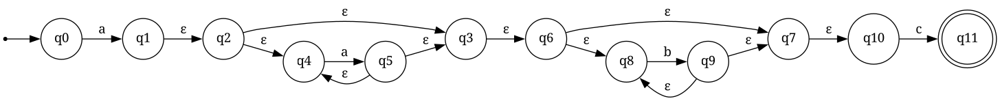
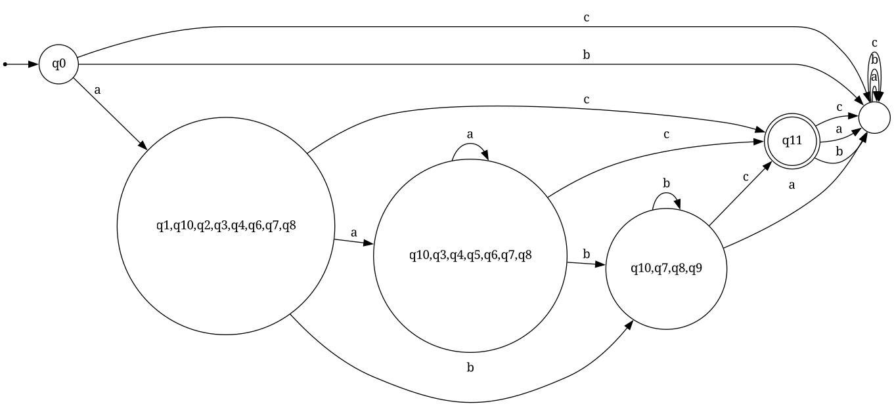

# Regex Engine

This project implements a regex engine in Rust, capable of parsing regular expressions, converting them into Non-deterministic Finite Automata (NFA), and further into Deterministic Finite Automata (DFA). The engine also supports visualization of NFAs and DFAs using Graphviz.

## Features

- **Regex Parsing**: Converts regular expressions into tokens and builds NFAs using Thompson's construction.
- **NFA to DFA Conversion**: Converts NFAs into DFAs for efficient pattern matching.
- **Visualization**: Generates `.dot` files and visualizes NFAs and DFAs using Graphviz.
- **Test Suite**: Includes a JSON-based test suite for validating regex functionality.
- ~~**DFA Minimization**: Minimizes the resulting DFA to have as few nodes as possible.~~

## Project Structure

```plaintext
regex/ 
├── .gitignore 
├── Cargo.lock 
├── Cargo.toml 
├── regex_tests.json 
├── src/ 
│   ├── dfa.rs 
│   ├── main.rs 
│   ├── nfa.rs 
│   ├── testing.rs 
│   └── helper/ 
│       ├── graphviz.rs 
│       ├── mod.rs 
│       ├── parser.rs 
│       └── thompson.rs 
```

### Key Files

- **`src/main.rs`**: Contains the main function that parses the `JSON` tests and validates them.
- **`src/nfa.rs`**: Defines the `NFA` struct and its methods, including state renaming and conversion from characters.
- **`src/dfa.rs`**: Defines the `DFA` struct and implements the conversion from `NFA` to `DFA`.
- **`src/helper/parser.rs`**: Contains functions for tokenizing and converting regex into postfix notation.
- **`src/helper/thompson.rs`**: Contains functions that relate to Thompson's algorithm regarding symbols on the regex.
- **`src/helper/graphviz.rs`**: Handles visualization of NFAs and DFAs using Graphviz.
- **`regex_tests.json`**: Contains test cases for validating regex functionality. Apart from the JSON provided, I also added the `visualize` parameter. If `true`, it will display a diagram with the NFA and DFA for that specific regex.

## Getting Started

### Prerequisites

- Rust (https://www.rust-lang.org/tools/install)
- Graphviz (https://graphviz.org/download/)

### Building the Project

To build the project, run:

```bash
cargo build
```

### Running the Tests

To execute the test suite, run:

```bash
cargo run
```

The test results will be displayed in the terminal, showing whether each test passed or failed.

### Visualizing NFAs and DFAs

If a test case has `"visualize": true` in `regex_tests.json`, the corresponding NFA and DFA will be visualized using Graphviz. Ensure Graphviz is installed and accessible via the `dot` command.

### Example Usage

Add a new regex test case to `regex_tests.json`:

```json
{
"name": "Example",
"regex": "a+b*c",
"visualize": true,
"test_strings": [
    { "input": "ac", "expected": true },
    { "input": "ab", "expected": false },
    { "input": "abc", "expected": true },
    { "input": "", "expected": false }
]
}
```

Run the project:

```bash
╭╴ matteoverz on fedora at …/regex via  main ( ) is 📦 v0.1.0 via 🦀 v1.84.1 
╰─$ cargo run
   Compiling regex v0.1.0 (/home/matteoverz/regex)
    Finished `dev` profile [unoptimized + debuginfo] target(s) in 0.38s
     Running `target/debug/regex`

=== Test suite Example: `a+b*c` ===
  ✅ [PASS] Input: "ac"       | Result matches expected: true
  ✅ [PASS] Input: "ab"       | Result matches expected: false
  ✅ [PASS] Input: "abc"      | Result matches expected: true
  ✅ [PASS] Input: ""         | Result matches expected: false

Ran 4 tests: 4 passed, 0 failed
```



